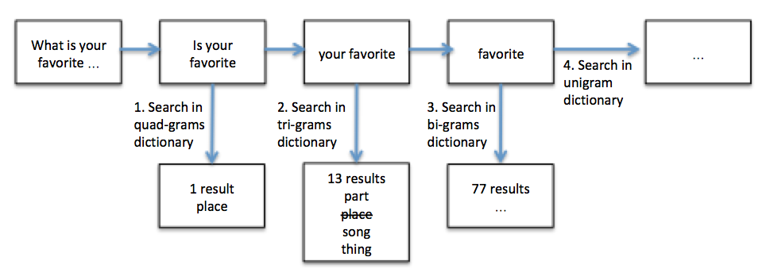
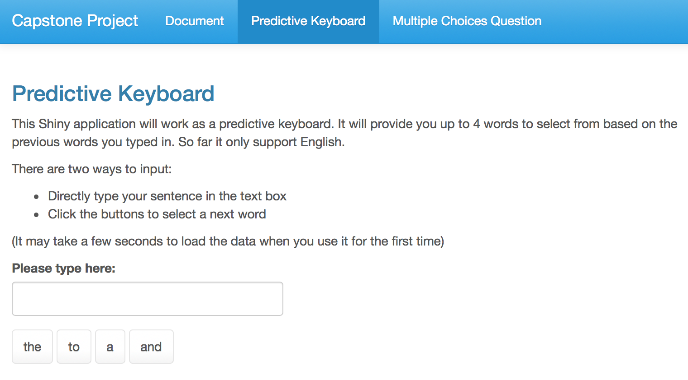

Predictive Keyboard
========================================================
author: Stella Li
date: 11.2017
autosize: true
font-family: 'cambria'

Introduction
========================================================

This capstone project is the final project of Coursera Specialization "Data Science."
The overall goal for this project is to build a predictive language model, based on the training data  ( [data.zip](https://d396qusza40orc.cloudfront.net/dsscapstone/dataset/Coursera-SwiftKey.zip) ) provided by the course (thanks to the partnership with SwiftKey).

This project includes two parts:

1. A Shiny application <https://stellali.shinyapps.io/PredictiveKeyboard/>
2. A slide deck consisting of no more than 5 slides created with R Studio Presenter

Algorithm(1)
========================================================
First part of the project is to generate dictionaries - basic n-gram models. There are several steps involved:

1. Select training data: training data was randomly selected from original files. The size of training data is about 3.5% of the original data.
2. Clean training data: A function GetVoc() was built to clean training data. It put everything into lower case, and removed non-alphabetic characters, except for "'", as I'd love to keep the words like "don't", "i'd", and "it's". Function ngrams() from package NLP was used to generate 2-, 3-, and 4-grams "vocabulary"
3. Build dictionaries: dictionaries were generated with function xtabs(). Then each dictionary was sorted by the frequency of word instances. 

Algorithm(2)
========================================================
Second part of the project is to build prediction model. 

The model will predict the next word based on the previous 3, 2, 1 words, and provide 4 unique potential "next word" options.   
***
In the example, the model searched 4-grams that start with "is your favorite", and then returned one result "place" and its probability. Then it went on to search "your favorite" in tri-grams dictionary and found 13 results. The first (with highest probability) 3 unique results were returned. If the model found less than 4 results from the quad- and tri-grams dictionaries, it would went on searching in bi- and uni-gram dictionaries. 

User Interface
=======================================================

<small>There are three tabs in the shiny app: a document page, the main predictive keyboard application page and an optional application that can help to solve "best next word" multi-choice questions. User can type into the text box, or click the buttons to enter the next word.</small>
